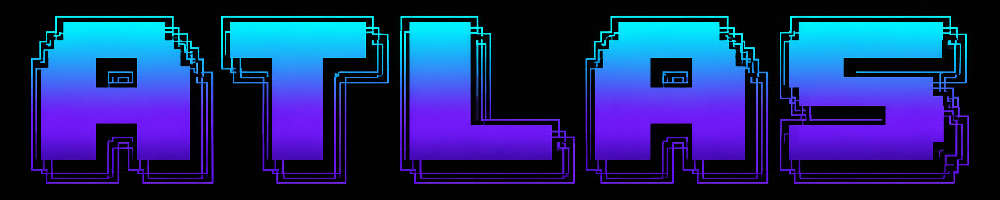

<div align="center">



### holds your world

### Atlas listens, acts, and hands the rest to its agents.

*A private AI assistant that carries your life, work, and everything in between —
always-on · on your own box · $0/min*


**[Setup guide](SETUP-GUIDE.md) · [Docs](docs/) · [Design](docs/DESIGN.md) · [Agent docs](docs/agents/) · [Roadmap](#%EF%B8%8F-roadmap)**

</div>

---

Atlas is a full-duplex **local voice assistant** — always listening, talks back, interruptible —
that runs next to you on your own hardware with **no API keys and no per-minute cost**. It keeps
its own fast on-device tools **and** acts as a **hub**: it can hand work to a registry of
specialist agents and **ping you back** when it's done. You talk only to Atlas; the agents are
never a menu you operate. (The assistant's name and voice are yours to configure —
`ATLAS_ASSISTANT_NAME` — Atlas is just the default.)

> **The voice loop is just the front door — the product is the assistant.**

Talks over: **weather · calendar · email · inbox · reminders · memory · SMS (from your own number) ·
invoices · channels · knowledge** — plus delegation to **Hermes** (messaging), **Jarvis**
(generalist), and **Open Claw** (coming).

**Default local stack:** faster-whisper (GPU) → qwen3 8B (Ollama) → Kokoro / Chatterbox TTS.
**Showtime mode:** Deepgram → OpenAI → Cartesia — premium voice for the wow demo, with the live
cost delta in the X-Ray footer.
**Voice transport:** native WebRTC (smallwebrtc) by default; **LiveKit / Daily** are an opt-in,
self-host path for mass-scale rooms (`ATLAS_VOICE_TRANSPORT=livekit`, guarded import — nothing
changes until you flip it).

```
┌─ companion apps ──────────────┐         ┌─ atlas (this repo) ─────────────────┐
│  📱 Atlas Android — approvals  │ ◀─ WS ─▶│  LocalAudioTransport (mic+speakers) │
│  🖥️  web UI — Neural-Brain HUD │  :8765  │  Silero VAD → STT → LLM → TTS       │
└────────────────────────────────┘         │  barge-in · trust tiers · tool gate │
   📞 phone API :8799 (approvals)           │  🤝 Agent Hub → Hermes / Jarvis     │
                                            └──────────────────────────────────────┘
```

## 🗺️ The Atlas family

| Surface | Where it lives | Status |
|---|---|---|
| **The brain** — voice loops, approval hub, tools, agent fabric | this repo | stable, used daily |
| **Wear OS watch** — the orb on your wrist | **[atlas-watch](https://github.com/Auto-Atlas/atlas-watch)** | **public beta** — sideload install, [guide](https://github.com/Auto-Atlas/atlas-watch#get-it-on-your-watch-beta) |
| **Android phone app** — remote approvals, status, memory, voice | **[atlas-android](https://github.com/Auto-Atlas/atlas-android)** (mirrored at [`eve-app/android`](eve-app/android)) | works, build-it-yourself |
| **iOS app** — approvals + status (Apple Watch later) | **[atlas-ios](https://github.com/Auto-Atlas/atlas-ios)** (mirrored at [`eve-app/ios`](eve-app/ios)) | early — **untested**, published for contributors |
| **Smart-glasses bridge** — MentraOS camera/speaker/display | **[atlas-glasses](https://github.com/Auto-Atlas/atlas-glasses)** (mirrored at [`glasses/mentra-eve`](glasses/mentra-eve)) | software tested; **never run on real glasses yet** |

The apps talk to this repo's approval API (`:8799`) and WebSocket stream — pair them
after the core is running.

### ⌚ On your wrist (beta)

The watch client is real and used daily: tap the orb to talk, tap to cut the assistant off,
long-press to hang up — streamed over one token-locked WebSocket, no VPN on the watch. It's
**beta and sideload-only** (no Play Store yet): you build two APKs and install the watch one
over wireless `adb`. The step-by-step guide lives in the
**[atlas-watch README](https://github.com/Auto-Atlas/atlas-watch#get-it-on-your-watch-beta)**.

## ✨ Highlights

- 🎙️ **Full-duplex voice** — always listening, barge-in under ~200 ms, real turn-taking (Silero VAD). No push-to-talk button.
- 🧰 **~27 local tools** — calendar, email, inbox, reminders, persistent memory, SMS from your own number, invoices, channels, knowledge, and more.
- 🤝 **Agent Hub** — Atlas silently routes work to specialist agents and confirms the handoff out loud (*"I'll have the messaging agent text Marco — ok?"*), then pings back asynchronously.
- 🔒 **Code-enforced trust** — voice recognition + trust tiers (owner / known / kid / unknown); risky tools are gated by code, not by a prompt.
- 🧠 **Thinking toggle** — flip on for a hard question (*"think this through"*), off for fast replies — from voice, the app, or the desktop UI.
- 🌅 **Proactive morning brief** — an optional 5 AM ritual: your *whys* read back verbatim, goals + a wiki-grounded strategy delegated to Hermes, surfaced as checkable action items on the app's **Today** tab (*"run my morning brief"* on demand).
- ⌚ **A watch, a phone, glasses** — approvals and live voice on a Wear OS watch (beta), an Android app, and a smart-glasses bridge.
- 📓 **Memory that's yours** — facts live in your Obsidian wiki, reloaded every session.
- 💸 **$0/min by default** — runs entirely on your GPU; showtime mode is opt-in.

## 🚀 Quick start

> New here / setting this up on your own machine? The full plain-English walkthrough — the phone
> texting bridge, and the 2-minute calendar/email hookups — is in **[SETUP-GUIDE.md](SETUP-GUIDE.md)**.

**One-line install** (clones to `~/atlas`, sets up the venv + model, auto-detects your GPU; needs git,
Python 3.11 and [Ollama](https://ollama.com) — it tells you exactly what to install if one is missing):

```powershell
# Windows
powershell -ExecutionPolicy Bypass -c "irm https://raw.githubusercontent.com/Auto-Atlas/atlas/main/install.ps1 | iex"
```
```bash
# Linux / macOS
curl -fsSL https://raw.githubusercontent.com/Auto-Atlas/atlas/main/install.sh | bash
```

Re-running updates everything in place. Prefer manual? The same steps by hand:

**1 · Prerequisites**
- Python 3.11
- [Ollama](https://ollama.com) with the brain: `ollama pull qwen3:8b`
- *(GPU)* NVIDIA driver + cuDNN 9 for faster-whisper — or set `WHISPER_DEVICE=cpu` to try first

**2 · Install**
```bash
python -m venv .venv && . .venv/bin/activate
pip install -r requirements.txt
cp .env.example .env          # every key is optional — fill in what you want
```

**3 · Run**
```bash
./run.sh                      # local mode, free
```
…or as always-on `systemd --user` services (`atlas-sidecar`, `atlas-approval-api`, …) — see the setup guide.

**4 · Talk to it** — walk the tiers:

| Tier | Say | Pass bar |
|---|---|---|
| **1 — Loop closes** | *"what's two plus two?"* | You hear a spoken "four." |
| **2 — Barge-in** | *"tell me about the Roman empire,"* then talk over it | It stops within ~200 ms and listens. |
| **3 — Turn-taking** | *"what's the weather… [pause] …in Boston?"* | It doesn't cut in on the pause. |
| **4 — Delegation** | *"have the messaging agent text Marco I'm running late"* | It confirms the handoff, says "on it," and pings back. |
| **5 — Thinking** | *"think this through, then …"* | It reasons before answering; *"back to fast mode"* returns. |

If Tier 1 fails it's almost always: Ollama not running, the wrong audio device, or cuDNN missing
(set `WHISPER_DEVICE=cpu` to isolate).

### ✅ Setup tracker

Copy this into your first issue (or a note) and check items off as you go:

```markdown
- [ ] Python 3.11 venv created, `pip install -r requirements.txt` clean
- [ ] Ollama running, `ollama pull qwen3:8b` done
- [ ] `.env` created from `.env.example` (every key optional to start)
- [ ] `./run.sh` — Tier 1 passes (spoken answer to "what's two plus two?")
- [ ] Tier 2–3 pass (barge-in + turn-taking)
- [ ] Speaker enrolled (see "Train Atlas on your voice") — trust tiers live
- [ ] Approval API on the tailnet (`tailscale serve --bg --https=8443 http://127.0.0.1:8799` -- if :8443 is already served, e.g. by the typed web UI, use another port like `--https=8446`)
- [ ] Phone paired via the QR ("Atlas, show the pairing QR") — the Android app in `eve-app/android`
- [ ] Optional: watch app ([atlas-watch](https://github.com/Auto-Atlas/atlas-watch), beta), agent delegation (`ATLAS_A2A_ENABLED=1`), morning brief, glasses bridge
```

## 🎙️ Using Atlas day-to-day

Just talk. It's always listening on the desktop (`bot.py`) and answers on the phone the
moment you open the app (`phone_bot.py`, WebRTC over your tailnet). Things you can say:

| You say | What happens |
|---|---|
| "What's on my calendar tomorrow?" | Reads your real Google Calendar (secret ICS URL). |
| "Put the dentist on my calendar Thursday at 2." | Drafts the event, reads it back, creates it on your "yes" ([setup](docs/calendar-write.md)). |
| "Text Marco the crew is running late." | Draft → read-back → your "yes" sends the SMS from your own number. |
| "Email him the quote." | Same gated flow over your Gmail. |
| "Have Hermes post the standup to Telegram." | Delegates to the Hermes agent; it says "on it" and tells you when it lands. |
| "Tell it to also include the metrics." | **Continues the same Hermes chat** — the agent keeps all its context. |
| "Answer Hermes: the standup channel." | Answers a question an agent asked mid-task (see talk-back below). |
| "Did that email go out?" / "What are you working on?" | The audit trail (`check_delegations`). |
| "Remind me at 4 to call Sam." | Durable reminder — survives restarts. |
| "Remember that Marco prefers mornings." | Long-term memory, recalled in future sessions. |

**It also comes to you** (nothing to ask): ~15 min before each calendar event, a morning
look-ahead at 8, an evening look-ahead at 8pm, agent results/blockers/questions as they
happen — spoken if you're at the mic, a **phone push** (self-hosted ntfy, [setup](deploy/ntfy/README.md))
when you're away or it's quiet hours, and anything undelivered replays next session.

**Approvals on the phone:** when a lower-trust speaker asks for something high-risk (or an
agent needs you), the phone gets a notification that deep-links the approval card in the
app. High-risk actions always read back a draft first — your spoken "yes" is the only thing
that releases it, exactly once.

## 🤝 The Agent Hub

Atlas is the **hub / chief-of-staff**. It keeps its own skills AND can hand work to a registry of
specialist agents — each a **declarative spec** (data, not hand-written code):

| Agent | Specialty | Transport | Status |
|---|---|---|---|
| **Hermes** | Messaging / comms (telegram, slack, sms, email…) + scheduling | CLI (`hermes -z`) | ✅ live |
| **Claude Code** | Coding agent — real repo work (features, fixes, reviews) delegated by voice | ACP (`claude` in the background, [setup](docs/acp-claude-code.md)) | ✅ live |
| **Jarvis** | Generalist brain (web, files, shell/code, git, memory) | HTTP / tiered CLI | wired as `jarvis_agent` |
| **Open Claw** | 20+ live channels + multi-agent routing | WebSocket gateway | 🔜 Phase 2 |

Work comes home **asynchronously**: a durable task store mints a correlation id, Atlas delegates and
says *"on it,"* and when the result lands it arrives through one universal connector → spoken at a
conversational gap (or **held & notified** during quiet hours) → and recorded in a queryable
**audit trail** (*"did that email go out?"*). Callbacks may **speak, notify, or propose — never
execute**: a proposed action re-enters the approval gate as a fresh confirmation. No double-sends:
a side-effecting agent runs **exactly once**.

Each agent's interface contract lives in **[`docs/agents/`](docs/agents/)**.

### 📡 Agent talk-back — agents genuinely talk BACK, mid-task

Delegated agents don't just return a result at the end — while working they can **push updates
to Atlas and even stop to ask you a question**, and Atlas relays it out loud:

> *You:* "Have Hermes post the standup."
> *Atlas (a minute later):* "Hermes is asking: should that go to the general channel or the
> standup channel?"
> *You:* "Answer Hermes: the standup channel."
> *Atlas:* "Passed it along." … *"Hermes finished — posted to the standup channel."*

How it works, in one pass:

- **Outbound** rides the industry-standard **Google A2A protocol** (`a2a-sdk`): the client
  delegates to a small **Hermes adapter service** (`atlas-a2a-hermes.service`, loopback, auth
  key) that runs `hermes -z` with a per-task talk-back header.
- **Mid-task talk-back** is a zero-dependency **MCP server** ([`eve_talkback_mcp.py`](eve_talkback_mcp.py))
  Hermes calls as tools: `notify_eve(kind=progress|result|blocker)` (informational, never ends
  the task) and **`ask_eve(question)` — which genuinely blocks** until you answer through the
  gate (`"answer hermes: …"` — the waiting task is found by agent name, never an id).
- **One gated inbound contract** ([`a2a_fabric.py`](a2a_fabric.py) `handle_push`, on the
  existing `:8787` loopback app): accepts both Atlas-shape JSON and **native A2A push events**;
  every message is authenticated by a **per-task capability token** (constant-time, dies with
  the task) and can only ever **stage a gated approval or be relayed as untrusted data — never
  execute anything**.
- **One delivery path** ([`agent_delivery.py`](agent_delivery.py), shared by the poller, the
  push route, and both voice bodies): spoken at the mic; **push-notified** (ntfy → Telegram)
  when you're away or in quiet hours — a pending question is the highest-priority notify and
  deep-links the phone app's approval card; always broadcast to the app; and anything
  undelivered (including unanswered questions and blockers) **replays at the next session**.
- **Adding an agent is a config flip, not a rewrite**: `delegate_registry` rows carry a
  `talkback` capability (`hermes="mcp"` live; `jarvis`/`open_claw` `"http"`, contract-tested,
  disabled until their services are verified — see each agent's doc for the exact payloads).

Enable with `ATLAS_A2A_ENABLED=1` (+ `ATLAS_A2A_ADAPTER_KEY`, `ATLAS_A2A_INBOUND_URL` — see
`.env.example`), start the adapter unit, and run
[`scripts/setup_hermes_talkback.sh`](scripts/setup_hermes_talkback.sh) once to register the
MCP server with Hermes. Verify end-to-end anytime with
[`scripts/talkback_harness.py`](scripts/talkback_harness.py) (real Hermes on a scratch DB —
touches nothing live). Flag off ⇒ the classic poller path, unchanged.

## 🔒 Security model

Atlas is voice-first and acts on your behalf, so trust is enforced **in code**, not in prompts:

- **Trust tiers** — every speaker is identified (owner / known / kid / unknown); each tool carries a risk level, and a tier can only fire tools at or below its cap. Fail-closed everywhere.
- **Confirm gates** — high-risk actions (send a message, create an invoice, delegate to an external agent) return a **draft** first; only an explicit "yes" releases the frozen draft, **exactly once**.
- **Owner-only + remote approval** — sensitive tools are owner-gated; a known speaker's high-risk request can be **staged** for the owner to approve from the phone.
- **Per-device identity (v2, opt-in)** — beyond the voice tier, each paired device gets its own **argon2id** credential (bootstrap-code pairing, revoke / rotate, dual-accept migration), and the device principal is decoupled from the speaker TTL. Turn on with `ATLAS_IDENTITY_V2=1`; the legacy voice-tier path is the default and unchanged. Constant-time compares on the auth path.
- **Import firewall** — the approval surface (phone API) can never import the voice runtime; enforced by a subprocess test.
- **Untrusted input is fenced** — anything from outside (an inbound SMS, an agent's result) enters the model as **data**, never as instructions.

Found a vulnerability? Please report it privately — see [SECURITY.md](SECURITY.md).

## 🗣️ Train Atlas on your voice (speaker recognition)

Trust tiers only kick in once Atlas can tell people apart. Until anyone is enrolled it runs in a
self-closing *"treat every voice as owner"* mode, so a fresh box still works while you set this up.

> **Easiest path: the phone app trains the voice for you.** The Android app's onboarding
> records a few clips and enrolls you automatically (`POST /v1/enroll` — no CLI, no config
> files). Pair the app, follow the wizard, done. Everything below is the manual/desktop
> path for finer control or re-enrollment.

> **The one rule: enroll from Atlas's OWN microphone, not an offline recording.** An offline clip
> lands in a slightly different audio domain and the real speaker gets false-rejected. So you
> capture a few minutes of live audio first, then build the profile from that.

**1 · Turn on speaker ID + live capture**, then just talk to Atlas normally for ~25–30 short utterances:
```bash
# in .env  (legacy EVE_* names work too — see atlas_env.py)
ATLAS_SPEAKER_ID=1
ATLAS_ENROLL_CAPTURE_DIR=~/atlas-enroll/owner
```
Restart the voice loop; each thing you say is saved as a `.wav` in that folder.

**2 · Enroll from those captures** (it averages them, so the profile matches your live audio):
```bash
.venv/bin/python enroll_speaker.py --name Owner --tier owner --wav-dir ~/atlas-enroll/owner
```
Tiers are `owner | known | kid`. It's re-runnable; a second `owner` needs `--force`.

**3 · Repeat per person** — `--name Alex --tier known --wav-dir ~/atlas-enroll/alex`, etc.

**4 · Calibrate the threshold** — check the separation between speakers, then set the cutoff
between the highest cross-speaker score and your own self-similarity:
```bash
.venv/bin/python enroll_speaker.py --calibrate
# then in .env, e.g.
ATLAS_SPEAKER_THRESHOLD=0.70
```

**5 · Remove `ATLAS_ENROLL_CAPTURE_DIR`** once you're enrolled.

> **If recognition gets flaky later:** re-add the capture dir, talk through ~25–30 utterances,
> re-enroll with `--wav-dir --force`, then remove the flag again.

| Knob | What it does |
|---|---|
| `ATLAS_SPEAKER_ID=1` | turn speaker recognition on |
| `ATLAS_VOICEPRINTS` | where profiles live (default `~/eve-voiceprints/profiles.json`) |
| `ATLAS_ENROLL_CAPTURE_DIR` | opt-in: dump live utterance WAVs here for enrollment |
| `ATLAS_SPEAKER_THRESHOLD` | match cutoff, e.g. `0.70` |
| `ATLAS_OWNER_PHRASE` (+ `_TTL_S`) | a spoken code-word that grants owner for a few minutes |

> Offline fallback: `enroll_speaker.py --name … --tier … --wav clip.wav` works from a single ~30 s
> clip, but prefer `--wav-dir` if live matching scores low. The voice encoder runs on CPU.

## 📱 Companion apps & phone pairing

Atlas ships with an **Android app** and a **web UI** that connect to it over your tailnet —
and a **Wear OS watch app in beta** ([atlas-watch](https://github.com/Auto-Atlas/atlas-watch)).

**Pair your phone in ~10 seconds — no token typing:**
1. Say ***"Atlas, show the pairing QR"*** (the `show_pairing_qr` skill). It renders a QR on
   screen encoding `eve://connect?base=<url>&token=<app-token>`.
2. Open the **Atlas app → Scan**, point it at the code — connected.

> Needs `ATLAS_APP_BASE_URL` (your tailnet URL for the phone API on `:8799`) and an app token in
> `approval_token.txt` (or `ATLAS_APP_TOKEN`). The QR carries both, so nothing is hardcoded or typed.

**Once paired, the app gives you:**
- ✅ **Remote approvals** — a known speaker's high-risk request lands on your phone with the requester's name; **hold-to-approve** releases it (and a safety hold even under reduced-motion).
- 🧠 **Thinking toggle** — flip the reasoning mode from the Status screen.
- 🗂️ **Skills feed** — push a skill to the assistant to use right now or save for the next chat.
- 🌅 **Today** — the morning ritual on your phone: whys, goals, today's strategy, and **checkable action items** (`GET /v1/today`).
- 📊 **Activity & Status** — the canonical **OpenJarvis feed**: a conversation / tool / delegation timeline + real engine telemetry & budget, with a graceful "desktop offline" state when the brain is down.
- 📓 **Memory** — read/add per-speaker facts, grouped by category with live search and learned-date pills.
- 🎙️ **Talk to Atlas** — a live voice channel to the sidecar.

The **web UI** (`app/frontend`, *openjarvis-chat*) is the desktop surface: the live **Neural-Brain
HUD**, the chat timeline + X-Ray footer, and the `THINK` toggle chip — all driven by the WebSocket
signal contract below.

**It also does** (some of the ~27 tools):
- 📲 **Real SMS from your own number** — *"text Mike I'm running late"* sends via an on-phone SMS gateway over the tailnet (staged draft → read-back → explicit "yes" → sent once, expires in 2 min). No Twilio.
- 📥 **Phone capture inbox** — notes/photos synced from the phone; *"anything in my inbox?"* reads the new ones.
- 🗣️ **Sales role-play coach** — grounded in a business pack you write yourself (`business_context.example.md` shows the structure); the assistant becomes the prospect, then grades your transcript.
- 📝 **Reviewable logs** — *"how did yesterday's conversations go?"* returns real numbers: exchanges, tool calls + outcomes, latency.

## ⚙️ Configuration

Everything is environment-driven with sane defaults — `cp .env.example .env`. Public names use
the `ATLAS_` prefix; the historical `EVE_*`/`JARVIS_*` names keep working forever
(`atlas_env.py` maps them, explicit legacy settings always win). A few of the knobs:

| Knob | Default | What it does |
|---|---|---|
| `OLLAMA_MODEL` | `qwen3:8b` | the local brain |
| `ATLAS_ASSISTANT_NAME` | `Atlas` | the assistant's name (also the silence-mode wake phrase) |
| `ATLAS_BRAIN_ORDER` | `codex,glm,local` | the `jarvis_agent` delegation chain |
| `ATLAS_VOICE_TRANSPORT` | `smallwebrtc` | phone voice transport; `livekit` opts into self-host LiveKit/Daily |
| `ATLAS_IDENTITY_V2` | *(off)* | per-device credential model; default = the legacy voice-tier path |
| `ATLAS_QUIET_HOURS` | *(unset)* | quiet window for ping-backs (e.g. `22-7`) → notify, don't speak aloud |
| `ATLAS_THINKING_EFFORT` | `medium` | reasoning effort when thinking mode is ON |
| `ATLAS_DELEGATE_HARD_S` | `180` | per-delegated-task time budget |
| `ATLAS_PHONE_ALLOW_INTERRUPTIONS` | `0` | phone barge-in; off by default so speakerphone echo can't self-interrupt |
| `ATLAS_MEMORY_PAGE` | *(set)* | the Obsidian page where memory lives |

## 📡 The live signal contract (drives the Neural-Brain UI)

`bridge.py` broadcasts one-line JSON events on `ws://127.0.0.1:8765`, each derived from a real
Pipecat frame — when the pipeline is silent, the WS is silent:

| Event | Source frame | Drives |
|---|---|---|
| `user_speaking` | Silero VAD start/stop | listening state |
| `interim_transcript` / `user_transcript` | Whisper partial/final | live captions |
| `mic_level` (0..1, ~15 Hz) | input audio RMS | inward neuron pulse |
| `thinking` | LLM response start/end | thinking state |
| `token` (batched) | LLM text stream | core flicker density |
| `bot_transcript` | TTS text | spoken captions |
| `bot_speaking` | bot started/stopped speaking | speaking state |
| `bot_level` (0..1, ~15 Hz) | TTS/output RMS | outward pulse |
| `metric` / `usage` | metrics frame | TTFB + token gauges |
| `thinking_mode` | the thinking toggle | the `THINK` chip state |

**Verify it's real:** open the web UI and talk — inward pulses track your actual voice word-by-word.
Kill the sidecar mid-sentence and the brain drops to calm idle within ~2.5 s (the UI also hard-gates
on event staleness). A scripted animation can't do that. Raw feed: `npx wscat -c ws://127.0.0.1:8765`.

## 🗺️ Roadmap

- ✅ **Local voice loop** + metrics bridge · barge-in · turn-taking
- ✅ **Trust tiers** + code-enforced tool policy
- ✅ **Companion apps** — Android approvals + web Neural-Brain HUD
- ✅ **Agent Hub Phase 1 (Hermes)** — delegate registry · async ping-back · audit trail
- ✅ **Thinking toggle** — manual on/off across voice + both apps
- ✅ **Proactive morning ritual** — 5 AM brief + wiki-grounded strategy + the app's **Today** tab
- ✅ **Per-device identity (v2)** — argon2id per-device creds + device principal (opt-in)
- ✅ **Wear OS watch (beta)** — orb-first live voice + approvals on the wrist ([atlas-watch](https://github.com/Auto-Atlas/atlas-watch))
- 🔜 **Phase 2** — Open Claw over its WebSocket gateway
- 🔜 **Phase 3** — fold `jarvis_agent` into the uniform registry
- 🔜 **Naming cleanup** — retire the legacy `eve://` scheme and internal EVE/JARVIS identifiers in one deliberate breaking release

## 🛠️ Troubleshooting

- **GPU not used / `no kernel image`** — driver too old; update to a CUDA the card supports, or `WHISPER_DEVICE=cpu`.
- **`Could not load cudnn`** — install cuDNN 9 for CUDA 12 and put its `bin` on PATH (or `WHISPER_DEVICE=cpu`).
- **No audio / wrong device** — set the correct default mic & speakers in your OS sound settings; the transport uses the system defaults.
- **Ollama connection refused** — make sure the Ollama service is running (`ollama ps`).
- **First run slow / downloading** — faster-whisper + TTS weights cache locally once; expected.

## 📜 License & lineage

Apache-2.0 — see [LICENSE](LICENSE) and [NOTICE](NOTICE). The `app/` directory is a vendored
fork of **[OpenJarvis](https://github.com/open-jarvis/OpenJarvis)** (Apache-2.0); everything
around it — the voice loops, trust tiers, tool layer, agent hub, watch/phone/glasses
surfaces — is what this project adds. Contributions welcome: see
[CONTRIBUTING.md](CONTRIBUTING.md).

## ⭐ Star tracker

If Atlas is useful to you, a star helps other people find it — and tells us what to build next.

[](https://star-history.com/#Auto-Atlas/atlas&Auto-Atlas/atlas-android&Auto-Atlas/atlas-watch&Date)
